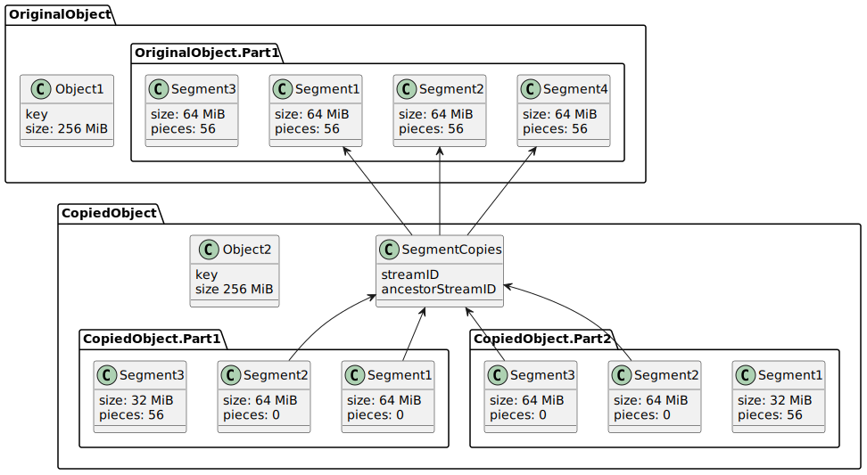

Byte Range Multipart Copy
===================

This document is a proposal on how to support S3's UploadPartCopy for Storj.

Blueprint background
------------

- Author: Erik van Velzen
- Requirements: https://docs.google.com/document/d/13VsXB01S7rK_4v3F_aiSXLW1INz4JoOTTVRKEgKjnvQ/edit#heading=h.5wzfc3vn57jc
- Issue: https://github.com/storj/storj/issues/4875
- Review: https://review.dev.storj.io/c/storj/storj/+/7914
- Present at initial meeting 16th june 2022: Jacob, Erik, Egon, Bill?, ???

Background
--------

UploadPartCopy is S3's way to copy objects larger than 5 GB. It extends multipart upload with the ability to copy byte ranges of existing objects.

Many S3 libraries such as boto3 for Python set a object size threshold, after which, uploads and copies will switch from CopyObject to UploadPartCopy. Given that we do not currently support UploadPartCopy this default threshold will return an error.

Customers expect their integrations to “just work” when Storj advertises S3 Compatibility. This feature gap frustrates customers as they’re onboarding and if not resolved, we will lose business.

AWS-CLI settings
-------------

AWS CLI has the following options related to UploadPartCopy:

- **multipart_threshold**: This value sets the size threshold for multipart uploads of individual files. The default value is 8 MB.
- **multipart_chunksize**: This value sets the size of each part that the AWS CLI uploads in a multipart upload for an individual file. This setting allows you to break down a larger file (for example, 300 MB) into smaller parts for quicker upload speeds. The default value is 8 MB.

We advise customers to increase these settings te reduce the number of roundtrips and the number of segments.

API additions
----------

We introduce this new Uplink method:

```go
project.CopyObjectRange(
    ctx context.Context, 
    sourceBucket string, 
    sourceKey string,
    offset int64,
    length int64,
    uploadID string, 
    partNumber uint32,
)
```

And add the following messages to the network protocol:

```protobuf
BeginCopyObjectRangeRequest {
    StreamID
    SourceBucket
    SourceEncryptedObjectKey
    Offset
    Length
}
BeginCopyObjectRangeResponse {
    EncryptedSegmentKeys
    FirstSegmentDownloadResponse
    FirstSegmentBeginResponse
    LastSegmentDownloadResponse
    LastSegmentBeginResponse
}
FinishCopyObjectRangeRequest {
    EncryptedSegmentKeys
    FirstSegmentCommitRequest
    LastSegmentCommitRequest
}
FinishCopyObjectRangeResponse {
    
}
```

Database schema changes
-----------------------

There are no database schema changes.

Sequence diagrams
-----------------

Below are the sequence diagrams for the existing copy and multipart upload flows. The last one is the new UploadPartCopy flow.

Note that the fields are not exhaustive and the naming is not final. 

Copy:


Multipart upload:


Multipart copy:


Metabase data shape
--------

Below shows an example of the resulting in metabase when a 256 MiB object has been copied using 160 MiB part size.

Observe that segment 3 has been split and it's pieces re-uploaded.

Many fields have been elided for clarity.



Open problems
-------------

There is a problem with the design, and that is that the copy might end up with more segments and parts than the source. Because segment_copies does not track the ancestor part+index, that would mean you can't easily find the ancestor segment. 

I can think of several solutions:

1) Find the parent segment by byte offset

2) Add segment position information to segment_copies

3) Don't allow copies where parts are unaligned with segments. I don't like this solution because it would mean that an (S3) client can copy some objects but not others, depending on how they were uploaded and the client settings.

4) fake it: only copy whole segments, even if the alignment doesn't match. So that the copied object eventually has the same segments as the source object. Ignore parts. When committing the copied object, verify that the entire object range was copied (or at least that the segments match all ranges). It also implies disallowing mixing UploadPart and UploadPartCopy for the same multipart upload.

I am leaning towards #4

Alternative solutions
--------

- Only allow copying parts which end and start on segment boundries. This would be good as a first implementation but I feel this would be too restrictive and not user-friendly because it means the S3 client will be able to copy some objects but not others depending on how they were uploaded and how the client is configured.

- Collapse small parts into bigger parts: due to e2e encryption this would have to be implemented in a stateful Gateway or Uplink, seems impossible on Satellite within our current data format.

- Remove the optional Orderlimits from `BeginCopyObjectRangeResponse`. This would implement 1 or 2 more roundtrips from Uplink to the Satellite if the segments are not aligned with the part. 

- Allow combining new objects from multiple source objects: This would make our database schema more complex. I don't think our customers will be using this.
